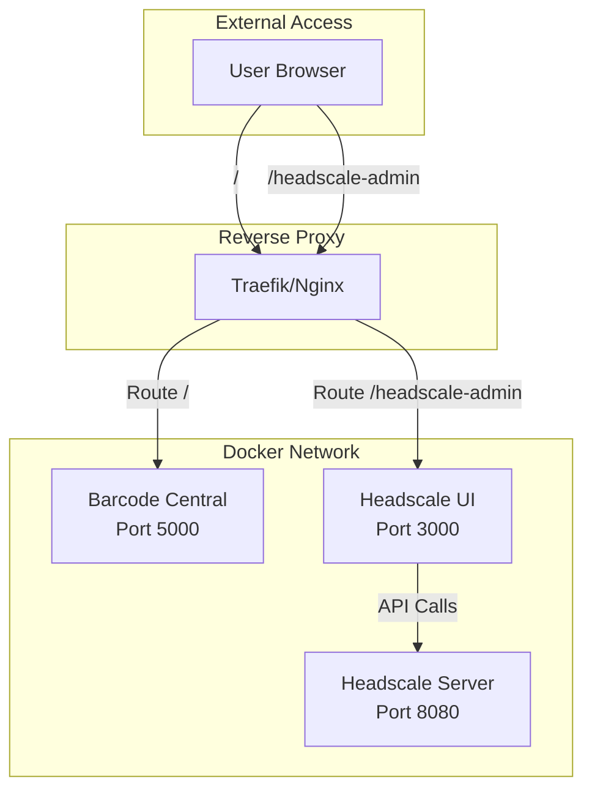

# Headscale UI Integration Plan

## Overview

This document outlines the integration of **headscale-ui** (by gurucomputing) into the Barcode Central deployment system. The web admin interface will be accessible at `/headscale-admin/` on the same domain as the main application.

## Architecture

### Routing Structure

```
https://print.example.com/                    → Barcode Central App (port 5000)
https://print.example.com/headscale-admin/    → Headscale UI (port 3000)
```

### Component Diagram



## Implementation Steps

### 1. Setup Script Modifications

**File**: `setup.sh`

Add new configuration option in the Headscale section:

```bash
# Step 4: Headscale Mesh VPN (existing)
if [[ "$use_headscale_choice" =~ ^[Yy]$ ]]; then
    USE_HEADSCALE=true
    
    # NEW: Ask about Headscale UI
    echo ""
    echo "Do you want to enable Headscale Web Admin UI?"
    echo "  • Manage users and machines via web interface"
    echo "  • Configure routes and ACLs"
    echo "  • Monitor network status"
    echo "  • Access at: https://$DOMAIN/headscale-admin/"
    echo ""
    read -p "Enable Headscale Web Admin UI? [Y/n]: " use_headscale_ui_choice
    
    if [[ ! "$use_headscale_ui_choice" =~ ^[Nn]$ ]]; then
        USE_HEADSCALE_UI=true
        
        # Generate credentials
        echo ""
        echo "Generating Headscale UI credentials..."
        HEADSCALE_UI_USER=${LOGIN_USER}
        HEADSCALE_UI_PASSWORD=$(generate_password)
        
        print_success "Headscale UI enabled"
        print_info "UI will be accessible at: https://$DOMAIN/headscale-admin/"
    else
        USE_HEADSCALE_UI=false
        print_info "Headscale UI disabled"
    fi
fi
```

### 2. Environment Variables

**File**: `.env` (generated by setup.sh)

Add these variables when Headscale UI is enabled:

```bash
# ============================================================================
# Headscale UI Configuration
# ============================================================================
HEADSCALE_UI_ENABLED=true
HEADSCALE_UI_USER=admin
HEADSCALE_UI_PASSWORD=<generated-password>
HEADSCALE_API_KEY=<generated-during-first-run>
```

### 3. Docker Compose Configuration

**File**: `docker-compose.yml` (generated by setup.sh)

Add Headscale UI service:

```yaml
  # Headscale Web Admin UI (Optional)
  headscale-ui:
    image: ghcr.io/gurucomputing/headscale-ui:latest
    container_name: headscale-ui
    restart: unless-stopped
    
    profiles:
      - headscale
    
    environment:
      - TZ=UTC
      - HS_SERVER=http://headscale:8080
      - SCRIPT_NAME=/headscale-admin
      - KEY=${HEADSCALE_API_KEY}
      - AUTH_TYPE=Basic
      - BASIC_AUTH_USER=${HEADSCALE_UI_USER}
      - BASIC_AUTH_PASS=${HEADSCALE_UI_PASSWORD}
    
    expose:
      - "3000"
    
    networks:
      - barcode-network
      - headscale-network
    
    depends_on:
      - headscale
    
    labels:
      - "com.barcodecentral.service=headscale-ui"
```

### 4. Traefik Configuration

**Labels for Headscale UI** (when Traefik is enabled):

```yaml
    labels:
      - "traefik.enable=true"
      
      # Router for /headscale-admin path
      - "traefik.http.routers.headscale-ui.rule=Host(`${DOMAIN}`) && PathPrefix(`/headscale-admin`)"
      - "traefik.http.routers.headscale-ui.entrypoints=websecure"
      - "traefik.http.routers.headscale-ui.tls=true"
      - "traefik.http.routers.headscale-ui.tls.certresolver=letsencrypt"
      
      # Service configuration
      - "traefik.http.services.headscale-ui.loadbalancer.server.port=3000"
      
      # Middleware: Strip prefix and add security headers
      - "traefik.http.middlewares.headscale-ui-stripprefix.stripprefix.prefixes=/headscale-admin"
      - "traefik.http.middlewares.headscale-ui-headers.headers.customrequestheaders.X-Script-Name=/headscale-admin"
      
      # Apply middlewares
      - "traefik.http.routers.headscale-ui.middlewares=headscale-ui-stripprefix,headscale-ui-headers,security-headers"
```

### 5. Nginx Configuration

**File**: `nginx.conf` (generated by setup.sh when not using Traefik)

Add location block for Headscale UI:

```nginx
# Headscale Web Admin UI
location /headscale-admin/ {
    proxy_pass http://localhost:3000/;
    proxy_set_header Host $host;
    proxy_set_header X-Real-IP $remote_addr;
    proxy_set_header X-Forwarded-For $proxy_add_x_forwarded_for;
    proxy_set_header X-Forwarded-Proto $scheme;
    proxy_set_header X-Script-Name /headscale-admin;
    
    # WebSocket support
    proxy_http_version 1.1;
    proxy_set_header Upgrade $http_upgrade;
    proxy_set_header Connection "upgrade";
    
    # Remove trailing slash redirect
    proxy_redirect / /headscale-admin/;
    
    # Timeouts
    proxy_connect_timeout 60s;
    proxy_send_timeout 60s;
    proxy_read_timeout 60s;
}

# Headscale API (for UI backend)
location /headscale-api/ {
    proxy_pass http://localhost:8080/;
    proxy_set_header Host $host;
    proxy_set_header X-Real-IP $remote_addr;
    proxy_set_header X-Forwarded-For $proxy_add_x_forwarded_for;
    proxy_set_header X-Forwarded-Proto $scheme;
}
```

### 6. API Key Generation Script

**File**: `scripts/generate-headscale-api-key.sh` (NEW)

```bash
#!/bin/bash
# Generate Headscale API key for UI

set -e

echo "=== Generating Headscale API Key ==="
echo ""

# Check if Headscale is running
if ! docker ps | grep -q headscale; then
    echo "Error: Headscale container is not running"
    echo "Start it with: docker compose up -d headscale"
    exit 1
fi

# Generate API key
echo "Generating API key..."
API_KEY=$(docker exec headscale headscale apikeys create --expiration 90d 2>&1 | grep -oP 'Key: \K.*' || echo "")

if [ -z "$API_KEY" ]; then
    echo "Error: Failed to generate API key"
    exit 1
fi

echo ""
echo "✓ API Key generated successfully!"
echo ""
echo "━━━━━━━━━━━━━━━━━━━━━━━━━━━━━━━━━━━━━━━━━━━━━━━━━━━━━━━━━━━━━━━━━━"
echo "API Key: $API_KEY"
echo "━━━━━━━━━━━━━━━━━━━━━━━━━━━━━━━━━━━━━━━━━━━━━━━━━━━━━━━━━━━━━━━━━━"
echo ""
echo "Add this to your .env file:"
echo "HEADSCALE_API_KEY=$API_KEY"
echo ""
echo "Then restart the Headscale UI:"
echo "docker compose restart headscale-ui"
echo ""
```

### 7. Docker Compose Profiles

Update the profiles logic in setup.sh:

```bash
# Add Docker Compose profiles
PROFILES=""
[ "$USE_TRAEFIK" = true ] && PROFILES="traefik"
[ "$USE_HEADSCALE" = true ] && PROFILES="${PROFILES:+$PROFILES,}headscale"

cat >> .env << EOF
# ============================================================================
# Docker Compose Profiles
# ============================================================================
COMPOSE_PROFILES=$PROFILES

EOF
```

## Configuration Summary

### Environment Variables

| Variable | Description | Example |
|----------|-------------|---------|
| `HEADSCALE_UI_ENABLED` | Enable/disable UI | `true` |
| `HEADSCALE_UI_USER` | Basic auth username | `admin` |
| `HEADSCALE_UI_PASSWORD` | Basic auth password | `<generated>` |
| `HEADSCALE_API_KEY` | API key for Headscale | `<generated>` |

### Ports

| Service | Internal Port | External Access |
|---------|---------------|-----------------|
| Barcode Central | 5000 | `https://domain.com/` |
| Headscale UI | 3000 | `https://domain.com/headscale-admin/` |
| Headscale API | 8080 | Internal only |

### Docker Networks

- `barcode-network`: Main application network
- `headscale-network`: Headscale mesh network

## Security Considerations

### 1. Authentication Layers

- **Basic Auth**: Username/password for UI access
- **API Key**: Headscale API authentication
- **HTTPS**: Encrypted transport (via Traefik/nginx)

### 2. Access Control

- UI accessible only via reverse proxy
- No direct port exposure for Headscale UI
- API key with expiration (90 days)

### 3. Best Practices

- Use strong generated passwords
- Rotate API keys regularly
- Consider IP whitelisting for `/headscale-admin/`
- Enable audit logging in Headscale

## Deployment Workflow

### Initial Setup

1. Run `./setup.sh` and enable Headscale + Headscale UI
2. Deploy with `docker compose up -d`
3. Generate API key: `./scripts/generate-headscale-api-key.sh`
4. Add API key to `.env`
5. Restart UI: `docker compose restart headscale-ui`
6. Access at `https://domain.com/headscale-admin/`

### Post-Deployment

1. Login with generated credentials
2. Create Headscale users/namespaces
3. Generate pre-auth keys for devices
4. Configure ACL policies
5. Monitor connected devices

## Testing Checklist

- [ ] Headscale UI accessible at `/headscale-admin/`
- [ ] Basic authentication works
- [ ] API connection to Headscale successful
- [ ] Can view/manage users
- [ ] Can view/manage machines
- [ ] Can configure routes
- [ ] SSL certificate valid (if using Traefik)
- [ ] No CORS errors in browser console
- [ ] Mobile responsive layout works

## Troubleshooting

### UI Not Accessible

```bash
# Check if container is running
docker ps | grep headscale-ui

# Check logs
docker logs headscale-ui

# Verify API key
docker exec headscale headscale apikeys list
```

### Authentication Fails

```bash
# Verify credentials in .env
cat .env | grep HEADSCALE_UI

# Check basic auth configuration
docker exec headscale-ui env | grep AUTH
```

### API Connection Issues

```bash
# Test Headscale API
curl http://localhost:8080/health

# Check network connectivity
docker exec headscale-ui ping headscale
```

## Documentation Updates

Files to update:

1. `PRODUCTION_DEPLOYMENT_GUIDE.md` - Add Headscale UI section
2. `DOCKER_COMPOSE_CONFIGURATIONS.md` - Add UI configuration examples
3. `QUICKSTART.md` - Mention UI option
4. `README.md` - Add UI to features list
5. `SECURITY_HARDENING_CHECKLIST.md` - Add UI security items

## Future Enhancements

- [ ] Add OAuth2 authentication option
- [ ] Implement role-based access control
- [ ] Add monitoring/metrics dashboard
- [ ] Create custom branding/theming
- [ ] Add API key rotation automation
- [ ] Implement audit logging viewer

## References

- Headscale UI GitHub: https://github.com/gurucomputing/headscale-ui
- Headscale Documentation: https://headscale.net/
- Docker Image: ghcr.io/gurucomputing/headscale-ui