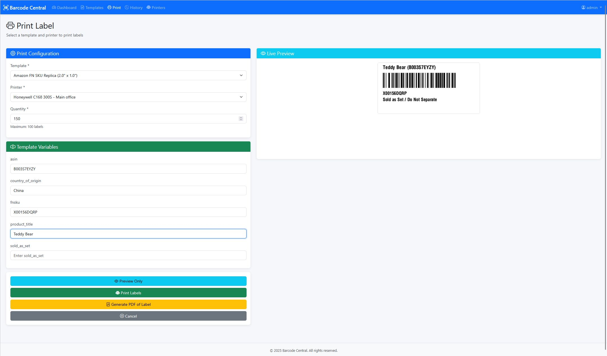
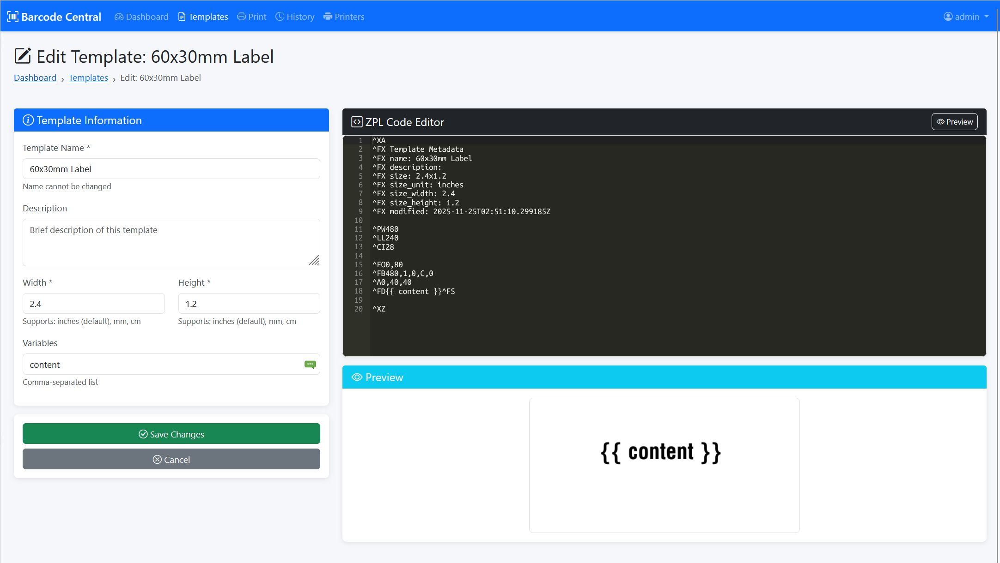
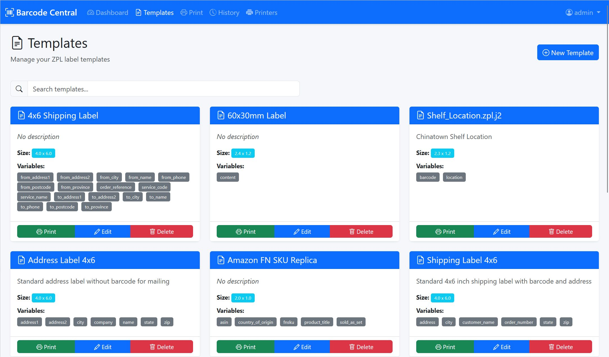
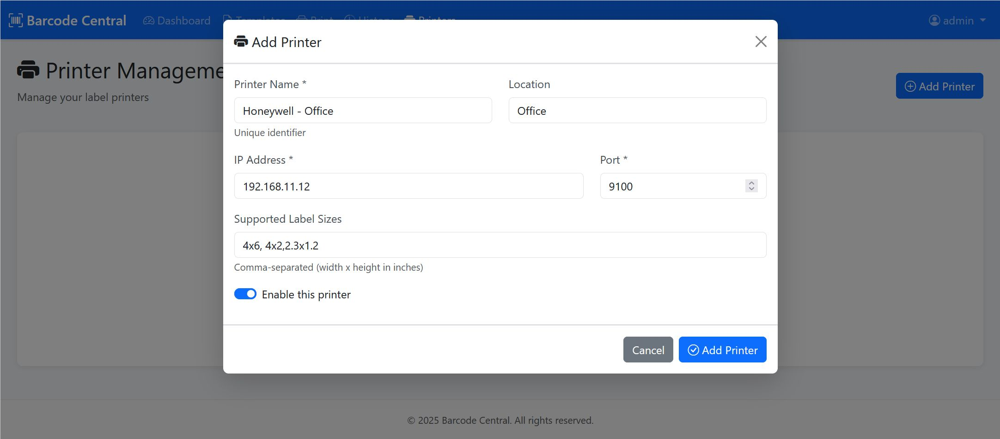
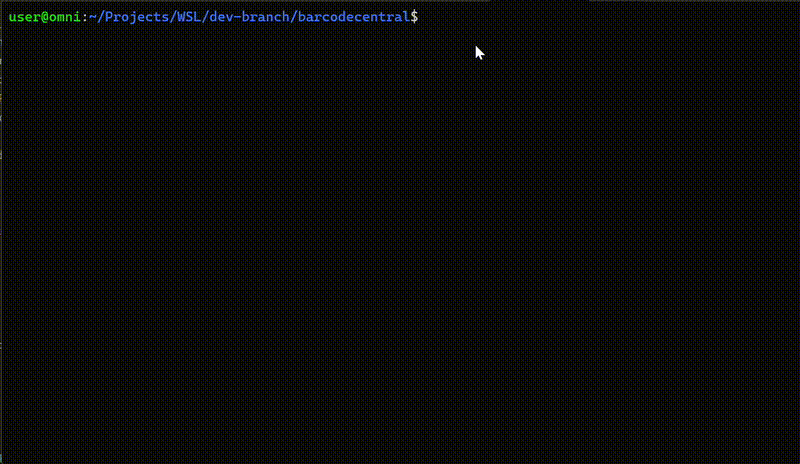

# Barcode Central

> **Repository**: [https://github.com/ZenDevMaster/barcodecentral](https://github.com/ZenDevMaster/barcodecentral)

A modern web application for managing and printing ZPL (Zebra Programming Language) labels to network printers. Built with Flask and designed for easy deployment with Docker.


## The Problem



You have networked thermal label printers, but the label maker software (such as Bartender), is expensive or not accessible to the whole company? 
The font desk needs to print a quick address label, Network engineer needs some cable labels, or the warehouse needs to quickly re-print a SKU barcode? 

Enter Barcode Central. A simple, easy to use web-based printing interface. You can quickly add your ZPL-compatible printers, create ZPL-based Jinja2 (templated!) labels, and print them over and over.

Barcode Central's primary mission is to get professional labels printed fast and easy.

Designed to be hosted locally inside your LAN or a small VPS. For VPS configurations it comes integrated with Headscale to create a (nearly) automatic VPN mesh - enabling direct access to your label printers hidden behind a firewalls. 


## Features

### 🏷️ Label Management
- **Template System**: Create and manage ZPL label templates with Jinja2 templating
- **Live Preview**: Generate PNG previews of labels before printing
- **Send to PDF**: Export to high quality PDF and send the label to someone else for printing
- **Template Editor**: Built-in code editor with syntax highlighting
- **Variable Substitution**: Dynamic label generation with custom data






### 🖨️ Printer Management
- **Network Printers**: Support for Zebra / ZPL Compatible network printers via TCP/IP
- **Multiple Printers**: Manage multiple printer configurations
- **Printer Testing**: Test connectivity and print test labels



### 📊 Print Job History
- **Job Tracking**: Complete history of all print jobs
- **Search & Filter**: Find jobs by template, printer, or date
- **Job Details**: View template data and parameters for each job
- **Export**: Download history data


### 🚀 Modern Architecture
- **RESTful API**: Clean API design for all operations
- **Responsive UI**: Works on desktop and mobile devices
- **Docker Ready**: Production-ready containerization
- **Health Checks**: Built-in monitoring endpoints


## Quick Start

### Clone from GitHub

```bash
# Clone the repository
git clone https://github.com/ZenDevMaster/barcodecentral.git
cd barcodecentral
```

### Using Docker (Recommended)

```bash
# Quickstart: Run through the configuration wizard
./setup.sh
```



Access the application at `http://localhost:5000`

Default credentials: Check your `.env` file for `LOGIN_USER` and `LOGIN_PASSWORD`

### Manual Installation

```bash
# 1. Create required directories
mkdir -p logs previews

# 2. Install dependencies
python3 -m venv venv
source venv/bin/activate
pip install -r requirements.txt

# 3. Configure environment
cp .env.example .env
nano .env

# 4. Create printer configuration (optional)
cp printers.json.example printers.json
nano printers.json

# 5. Run development server
./run_dev.sh
```

## Configuration

### Environment Variables

Key configuration options in `.env`:

```env
# Security
SECRET_KEY=your-secret-key-here
LOGIN_USER=admin
LOGIN_PASSWORD=your-password

# Application
FLASK_ENV=production
FLASK_DEBUG=0
LOG_LEVEL=INFO
```

See [`.env.production.example`](.env.production.example) for all options.

### Printer Configuration

Add printers via the web interface or edit `printers.json`:

```json
[
  {
    "id": "printer-1",
    "name": "Warehouse Printer",
    "ip": "192.168.1.100",
    "port": 9100,
    "description": "Main warehouse label printer"
  }
]
```

### Template Configuration

Templates are stored in `templates_zpl/` directory as `.zpl.j2` files:

```zpl
^XA
^FO50,50^A0N,50,50^FD{{ product_name }}^FS
^FO50,120^BY3^BCN,100,Y,N,N^FD{{ barcode }}^FS
^XZ
```

## License

MIT License - See [LICENSE](LICENSE) file for details

## Support

For issues, questions, or contributions:

- **GitHub Issues**: [Report bugs or request features](https://github.com/ZenDevMaster/barcodecentral/issues)
- **GitHub Discussions**: [Ask questions and share ideas](https://github.com/ZenDevMaster/barcodecentral/discussions)
- **Documentation**: Check [DEPLOYMENT.md](DEPLOYMENT.md) for deployment help
- **API Docs**: Review [API Documentation](roo-docs/endpoints.md)


## Acknowledgments

- Flask framework and community
- Zebra Technologies for ZPL documentation
- Docker for containerization platform
- All contributors and users

---

**Version**: 1.0.0  
**Last Updated**: 2025-11-01  
**Maintained by**: ZenDevMaster / Zendrian Inc