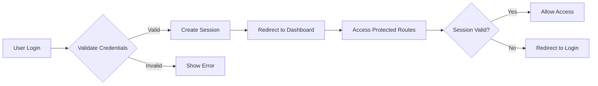
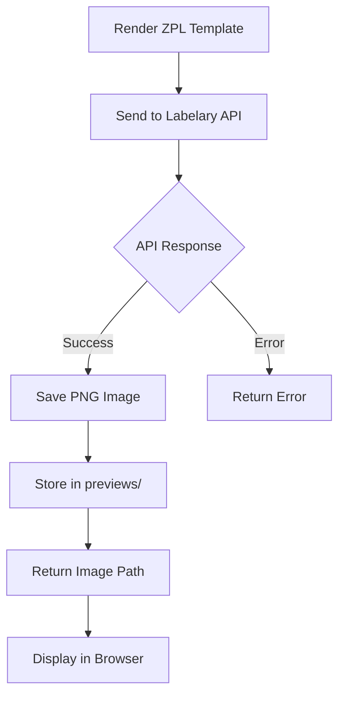
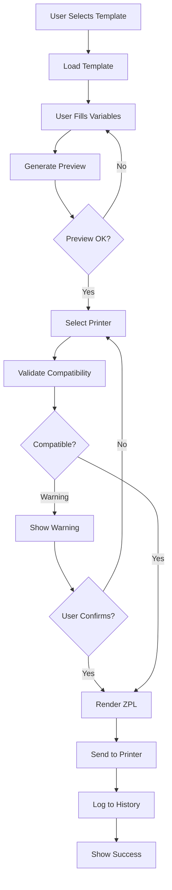
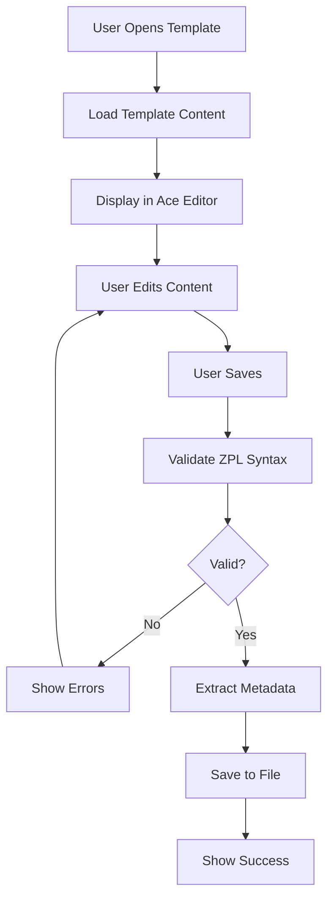
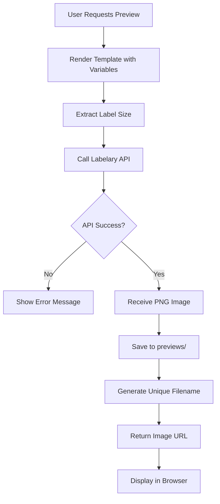
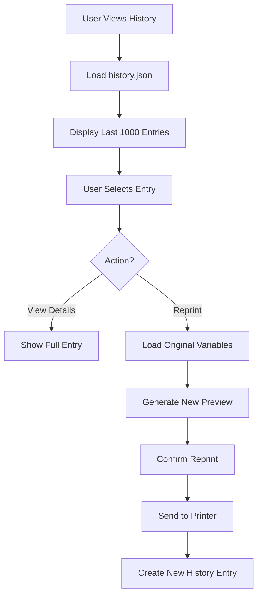

# Barcode Central - System Architecture

## Overview

Barcode Central is a Flask-based web application designed for generating and printing ZPL (Zebra Programming Language) labels. The system provides template management, printer integration, preview generation, and print history tracking with a simple authentication layer.

## Architecture Principles

1. **Simplicity First**: No database, no complex authentication providers
2. **Self-Contained**: All dependencies bundled, minimal external dependencies
3. **File-Based Storage**: JSON files for configuration and history
4. **Stateless Operations**: Each print job is independent
5. **Multi-User Support**: Session-based authentication with concurrent user support

## System Components

### 1. Core Application Layer

```
┌─────────────────────────────────────────────────────────────┐
│                     Flask Application                        │
│  ┌──────────────┐  ┌──────────────┐  ┌──────────────┐      │
│  │ Auth Module  │  │   Template   │  │   Printer    │      │
│  │ (Flask-Login)│  │   Manager    │  │   Manager    │      │
│  └──────────────┘  └──────────────┘  └──────────────┘      │
│  ┌──────────────┐  ┌──────────────┐  ┌──────────────┐      │
│  │   Preview    │  │   History    │  │   Session    │      │
│  │   Generator  │  │   Logger     │  │   Manager    │      │
│  └──────────────┘  └──────────────┘  └──────────────┘      │
└─────────────────────────────────────────────────────────────┘
```

### 2. Data Storage Layer

```
┌─────────────────────────────────────────────────────────────┐
│                      File System                             │
│  ┌──────────────┐  ┌──────────────┐  ┌──────────────┐      │
│  │    .env      │  │ printers.json│  │ history.json │      │
│  │ (credentials)│  │  (config)    │  │   (logs)     │      │
│  └──────────────┘  └──────────────┘  └──────────────┘      │
│  ┌──────────────┐  ┌──────────────┐                        │
│  │templates_zpl/│  │  previews/   │                        │
│  │ (*.zpl.j2)   │  │  (images)    │                        │
│  └──────────────┘  └──────────────┘                        │
└─────────────────────────────────────────────────────────────┘
```

### 3. External Integration Layer

```
┌─────────────────────────────────────────────────────────────┐
│                   External Services                          │
│  ┌──────────────┐  ┌──────────────┐                        │
│  │  Labelary    │  │   Zebra      │                        │
│  │     API      │  │   Printers   │                        │
│  │  (Preview)   │  │ (TCP:9100)   │                        │
│  └──────────────┘  └──────────────┘                        │
└─────────────────────────────────────────────────────────────┘
```

## Component Details

### Authentication Module

**Purpose**: Simple credential-based authentication using environment variables

**Components**:
- Flask-Login for session management
- `.env` file for credential storage
- Session cookies for user state

**Flow**:


**Security Features**:
- Session-based authentication
- Secure session cookies (httponly, secure flags)
- Password stored as environment variable (not in code)
- CSRF protection on forms
- Login required decorator on protected routes

### Template Manager

**Purpose**: Manage ZPL templates with Jinja2 variable substitution

**Components**:
- Template file scanner (`templates_zpl/` directory)
- Jinja2 template renderer
- Template metadata extractor
- Template validator

**Template Structure**:
- Files stored as `*.zpl.j2` in `templates_zpl/` directory
- Jinja2 syntax for variable substitution: `{{ variable_name }}`
- Metadata in template comments: `^FX METADATA: key=value`
- Label size specification: `^FX SIZE: 4x6` or `^FX SIZE: 2x1`

**Operations**:
1. **List Templates**: Scan directory, extract metadata
2. **Load Template**: Read file, parse Jinja2 template
3. **Render Template**: Substitute variables, generate ZPL
4. **Validate Template**: Check syntax, verify label size
5. **Edit Template**: Update file content, preserve metadata

### Printer Manager

**Purpose**: Manage printer configurations and validate compatibility

**Components**:
- Printer configuration loader (`printers.json`)
- Printer availability checker (TCP connection test)
- Label size validator
- Print job dispatcher

**Printer Configuration**:
```json
{
  "name": "Warehouse Printer",
  "ip": "192.168.1.100",
  "port": 9100,
  "supported_sizes": ["4x6", "4x3"],
  "dpi": 203
}
```

**Validation Logic**:
- Check printer reachability (TCP socket test)
- Validate label size compatibility
- Warn if size mismatch (allow override)
- Track printer status (online/offline)

### Preview Generator

**Purpose**: Generate visual previews of ZPL labels using Labelary API

**Components**:
- Labelary API client
- Image cache manager
- Preview cleanup scheduler

**Preview Flow**:


**API Integration**:
- Endpoint: `http://api.labelary.com/v1/printers/{dpi}dpi/labels/{width}x{height}/0/`
- Method: POST
- Content-Type: `application/x-www-form-urlencoded`
- Response: PNG image

**Cleanup Strategy**:
- Preview files stored with timestamp in filename
- Cleanup job runs daily (configurable)
- Delete previews older than 7 days
- Keep previews referenced in recent history (last 1000 entries)

### History Logger

**Purpose**: Track all print jobs for auditing and reprinting

**Components**:
- History file manager (`history.json`)
- Entry rotation manager (keep last 1000)
- Reprint functionality

**History Entry Structure**:
```json
{
  "id": "uuid-string",
  "timestamp": "2025-11-24T01:45:00Z",
  "user": "admin",
  "template": "shipping_label.zpl.j2",
  "variables": {"name": "John Doe", "address": "123 Main St"},
  "printer": "Warehouse Printer",
  "printer_ip": "192.168.1.100",
  "quantity": 5,
  "label_size": "4x6",
  "preview_path": "previews/20251124_014500_uuid.png",
  "status": "success",
  "error": null
}
```

**Rotation Logic**:
- Keep last 1000 entries
- Rotate on each new entry if count > 1000
- Remove oldest entries first
- Preserve preview images for kept entries
- Delete preview images for rotated entries

### Session Manager

**Purpose**: Handle user sessions and concurrent access

**Components**:
- Flask session management
- User state tracking
- Concurrent user support

**Session Data**:
- User ID (from login)
- Login timestamp
- Last activity timestamp
- Session preferences (optional)

**Concurrency Handling**:
- Each user has independent session
- File operations use file locking
- History writes are atomic
- Preview generation is per-request

## Data Flow Diagrams

### Print Job Flow



### Template Edit Flow



### Preview Generation Flow



### History and Reprint Flow



## Security Considerations

### Authentication
- Credentials stored in `.env` file (not in version control)
- Session cookies with secure flags (httponly, secure, samesite)
- CSRF protection on all forms
- Login required decorator on protected routes
- Session timeout after inactivity (configurable)

### File Access
- Template files restricted to `templates_zpl/` directory
- No arbitrary file read/write operations
- Path traversal prevention
- File upload validation (if implemented)

### Network Security
- Printer communication over internal network only
- No external printer access
- Labelary API calls over HTTPS
- Rate limiting on preview generation (optional)

### Data Protection
- No sensitive data in templates (use variables)
- History entries contain only print metadata
- Preview images cleaned up regularly
- No PII stored permanently

## Performance Considerations

### Caching Strategy
- Template metadata cached in memory
- Printer status cached (5-minute TTL)
- Preview images cached on disk
- Session data in Flask session

### Optimization Points
- Lazy loading of templates
- Async printer status checks (optional)
- Preview generation throttling
- History pagination (100 entries per page)

### Resource Management
- Preview cleanup job (daily)
- History rotation (keep 1000 entries)
- Session cleanup (expired sessions)
- File handle management (proper close)

## Error Handling

### Error Categories
1. **Authentication Errors**: Invalid credentials, session expired
2. **Template Errors**: Invalid syntax, missing variables, file not found
3. **Printer Errors**: Unreachable, incompatible size, communication failure
4. **Preview Errors**: Labelary API failure, invalid ZPL, network error
5. **History Errors**: File corruption, disk full, permission denied

### Error Response Strategy
- User-friendly error messages
- Detailed logging for debugging
- Graceful degradation (preview optional)
- Retry logic for transient failures
- Error state recovery

## Scalability Considerations

### Current Limitations
- Single-server deployment
- File-based storage (not distributed)
- Synchronous print operations
- Limited to ~1000 history entries

### Future Enhancements
- Database backend (SQLite/PostgreSQL)
- Async print queue (Celery/RQ)
- Distributed preview cache (Redis)
- Multi-server deployment (load balancer)
- API rate limiting
- Webhook notifications

## Technology Stack

### Backend
- **Python 3.9+**: Core language
- **Flask 2.x**: Web framework
- **Flask-Login**: Session management
- **Jinja2**: Template engine (HTML and ZPL)
- **Requests**: HTTP client (Labelary API)
- **python-dotenv**: Environment variable management

### Frontend
- **HTML5/CSS3**: UI structure and styling
- **JavaScript (Vanilla)**: Client-side logic
- **Ace Editor**: Code editor for templates
- **Bootstrap 5** (optional): UI framework

### Storage
- **JSON Files**: Configuration and history
- **File System**: Templates and previews

### External Services
- **Labelary API**: Preview generation
- **Zebra Printers**: Label printing (TCP/IP)

## Deployment Architecture

### Development Environment
```
┌─────────────────────────────────────┐
│         WSL (Ubuntu)                │
│  ┌──────────────────────────────┐  │
│  │   Python venv                │  │
│  │   Flask Dev Server           │  │
│  │   Port: 5000                 │  │
│  └──────────────────────────────┘  │
│  ┌──────────────────────────────┐  │
│  │   File System                │  │
│  │   - templates_zpl/           │  │
│  │   - previews/                │  │
│  │   - printers.json            │  │
│  │   - history.json             │  │
│  └──────────────────────────────┘  │
└─────────────────────────────────────┘
```

### Production Environment (Docker)
```
┌─────────────────────────────────────┐
│         Docker Container            │
│  ┌──────────────────────────────┐  │
│  │   Gunicorn + Flask           │  │
│  │   Port: 8000                 │  │
│  └──────────────────────────────┘  │
│  ┌──────────────────────────────┐  │
│  │   Volumes (Mounted)          │  │
│  │   - /app/templates_zpl       │  │
│  │   - /app/previews            │  │
│  │   - /app/printers.json       │  │
│  │   - /app/history.json        │  │
│  │   - /app/.env                │  │
│  └──────────────────────────────┘  │
└─────────────────────────────────────┘
         │
         ▼
┌─────────────────────────────────────┐
│      Host File System               │
│   - Persistent data storage         │
│   - Configuration files             │
└─────────────────────────────────────┘
```

## Configuration Management

### Environment Variables (.env)
```
# Authentication
LOGIN_USER=admin
LOGIN_PASSWORD=secure_password_here

# Flask Configuration
FLASK_SECRET_KEY=random_secret_key_here
FLASK_ENV=production

# Application Settings
SESSION_TIMEOUT=3600
PREVIEW_CLEANUP_DAYS=7
HISTORY_MAX_ENTRIES=1000

# Labelary API
LABELARY_API_URL=http://api.labelary.com/v1/printers
LABELARY_DEFAULT_DPI=203
```

### Printer Configuration (printers.json)
- Managed through web UI or manual editing
- Validated on application startup
- Reloaded on configuration change

### Template Metadata
- Embedded in ZPL template files as comments
- Extracted on template load
- Used for validation and UI display

## Monitoring and Logging

### Application Logs
- Flask application logs (INFO level)
- Error logs (ERROR level)
- Access logs (optional)
- Print job logs (in history.json)

### Health Checks
- Application health endpoint (`/health`)
- Printer connectivity status
- File system availability
- Labelary API availability

### Metrics (Optional)
- Print job count
- Template usage statistics
- Printer utilization
- Preview generation rate
- Error rate by category

## Maintenance Tasks

### Daily Tasks
- Preview cleanup (delete old files)
- Session cleanup (expired sessions)
- Log rotation (if file-based logging)

### Weekly Tasks
- History backup
- Configuration backup
- Printer connectivity audit

### Monthly Tasks
- Review history retention policy
- Update printer configurations
- Template library review

## Conclusion

This architecture provides a solid foundation for the Barcode Central application, balancing simplicity with functionality. The file-based approach keeps deployment simple while supporting multiple concurrent users. The modular design allows for future enhancements without major refactoring.