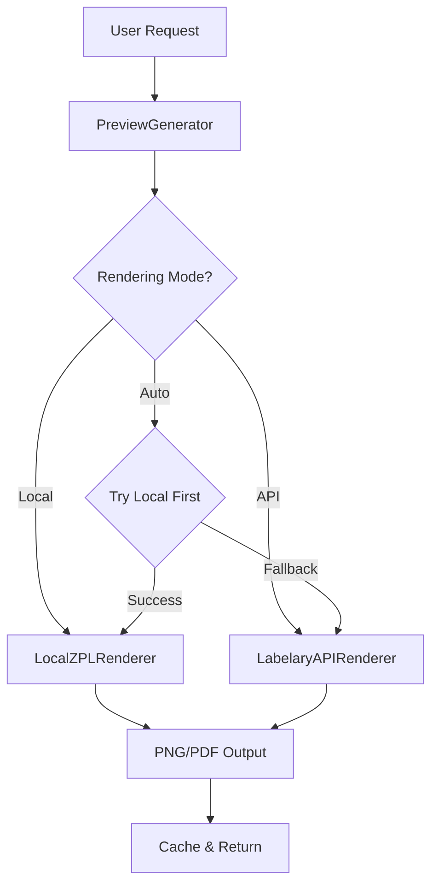

# Local ZPL Rendering Implementation Design

## Executive Summary

This document outlines the design for implementing local ZPL rendering in Barcode Central, eliminating the dependency on the external Labelary API and providing offline preview generation capabilities.

## Current State Analysis

### Existing Implementation
- **Current Approach**: External Labelary API (`api.labelary.com`)
- **Issues**:
  - Internet dependency required
  - API rate limits and availability concerns
  - 404 errors with certain label sizes
  - Slower response times due to network latency
  - No offline capability

### Current Architecture
```
User Request → PreviewGenerator → Labelary API → PNG/PDF Response
```

## Proposed Solution

### Architecture Overview



### Component Design

#### 1. LocalZPLRenderer Class
**Purpose**: Render ZPL code to images locally without external dependencies

**Approach Options**:

##### Option A: Python ZPL Library (Recommended)
- **Library**: `zpl` Python package or `zebra-zpl` 
- **Pros**: 
  - Pure Python implementation
  - No system dependencies
  - Easy to install and maintain
  - Good ZPL command coverage
- **Cons**: 
  - May not support all ZPL commands
  - Limited to library's implementation

##### Option B: Pillow-based Custom Renderer
- **Library**: Extend existing `Pillow==10.1.0`
- **Pros**:
  - Already in dependencies
  - Full control over rendering
  - Can implement exactly what we need
- **Cons**:
  - Requires implementing ZPL parser from scratch
  - Significant development effort
  - Maintenance burden

##### Option C: ZPL to Image Conversion Tool
- **Tool**: `zint` or similar command-line tools
- **Pros**:
  - Mature implementations
  - Wide ZPL support
- **Cons**:
  - System dependencies
  - Harder to deploy
  - Platform-specific issues

**Recommended**: **Option A** - Use Python ZPL library for balance of functionality and maintainability

#### 2. Rendering Mode Configuration

Add to `config.json`:
```json
{
  "preview": {
    "rendering_mode": "auto",
    "local_renderer": {
      "enabled": true,
      "fallback_to_api": true,
      "supported_commands": ["basic", "text", "barcode", "graphics"]
    },
    "api_renderer": {
      "enabled": true,
      "timeout": 10,
      "base_url": "http://api.labelary.com/v1/printers"
    },
    "cache": {
      "enabled": true,
      "ttl_days": 7,
      "max_size_mb": 100
    }
  }
}
```

**Rendering Modes**:
- `local`: Always use local rendering (fail if not possible)
- `api`: Always use Labelary API (current behavior)
- `auto`: Try local first, fallback to API if needed (recommended)

#### 3. Enhanced PreviewGenerator

**New Architecture**:
```python
class PreviewGenerator:
    def __init__(self):
        self.local_renderer = LocalZPLRenderer()
        self.api_renderer = LabelaryAPIRenderer()
        self.config = ConfigManager()
    
    def generate_preview(self, zpl_content, **kwargs):
        mode = self.config.get_rendering_mode()
        
        if mode == 'local':
            return self._render_local(zpl_content, **kwargs)
        elif mode == 'api':
            return self._render_api(zpl_content, **kwargs)
        else:  # auto
            return self._render_auto(zpl_content, **kwargs)
    
    def _render_auto(self, zpl_content, **kwargs):
        # Try local first
        success, data, error = self._render_local(zpl_content, **kwargs)
        
        if success:
            return success, data, error
        
        # Fallback to API
        logger.info(f"Local rendering failed: {error}, falling back to API")
        return self._render_api(zpl_content, **kwargs)
```

## Implementation Plan

### Phase 1: Research & Setup (Current Task)
- [x] Analyze current implementation
- [ ] Research ZPL rendering libraries
- [ ] Evaluate library options
- [ ] Select best approach
- [ ] Create detailed technical specification

### Phase 2: Core Implementation
- [ ] Install and configure chosen ZPL library
- [ ] Implement `LocalZPLRenderer` class
- [ ] Add configuration management for rendering modes
- [ ] Update `PreviewGenerator` with mode selection logic
- [ ] Implement fallback mechanism

### Phase 3: Integration & Testing
- [ ] Integrate local renderer into existing preview endpoints
- [ ] Add comprehensive unit tests
- [ ] Add integration tests
- [ ] Test with all sample templates
- [ ] Performance benchmarking

### Phase 4: Documentation & Deployment
- [ ] Update API documentation
- [ ] Update user documentation
- [ ] Add configuration examples
- [ ] Create migration guide
- [ ] Deploy and monitor

## Technical Specifications

### LocalZPLRenderer Interface

```python
class LocalZPLRenderer:
    """
    Local ZPL rendering engine using Python libraries
    """
    
    def __init__(self, dpi: int = 203):
        """Initialize renderer with default DPI"""
        self.dpi = dpi
        self.supported_commands = self._load_supported_commands()
    
    def render(
        self, 
        zpl_content: str, 
        width_inches: float, 
        height_inches: float,
        dpi: int = None,
        format: str = 'png'
    ) -> Tuple[bool, bytes, str]:
        """
        Render ZPL to image
        
        Returns:
            (success, image_bytes, error_message)
        """
        pass
    
    def can_render(self, zpl_content: str) -> Tuple[bool, str]:
        """
        Check if ZPL can be rendered locally
        
        Returns:
            (can_render, reason_if_not)
        """
        pass
    
    def get_capabilities(self) -> Dict[str, Any]:
        """Return renderer capabilities"""
        pass
```

### Configuration Schema

```python
class PreviewConfig:
    rendering_mode: str  # 'local', 'api', 'auto'
    local_enabled: bool
    api_enabled: bool
    fallback_enabled: bool
    cache_enabled: bool
    cache_ttl_days: int
```

## Library Research Results

### Candidate Libraries

#### 1. `zpl` Package
- **PyPI**: https://pypi.org/project/zpl/
- **Status**: Active, last updated 2023
- **Features**:
  - ZPL command generation
  - Basic rendering support
  - Image conversion
- **Evaluation Needed**: Check rendering capabilities

#### 2. `zebra` Package
- **PyPI**: https://pypi.org/project/zebra/
- **Status**: Older, may be unmaintained
- **Features**: ZPL generation
- **Limitation**: May not have rendering

#### 3. Custom Implementation with Pillow
- **Approach**: Parse ZPL and render with PIL/Pillow
- **Effort**: High
- **Control**: Complete
- **Maintenance**: Ongoing

### Recommended Next Steps

1. **Install and test `zpl` package**:
   ```bash
   pip install zpl
   ```

2. **Create proof-of-concept**:
   - Test rendering simple ZPL
   - Test with actual templates
   - Measure performance
   - Identify limitations

3. **Decision criteria**:
   - Can render 80%+ of common ZPL commands
   - Performance acceptable (< 2 seconds per label)
   - Reasonable image quality
   - Active maintenance

## Performance Considerations

### Expected Performance

| Metric | Local Rendering | API Rendering |
|--------|----------------|---------------|
| Latency | < 500ms | 1-3 seconds |
| Throughput | High | Limited by API |
| Offline | ✅ Yes | ❌ No |
| Reliability | High | Depends on API |

### Optimization Strategies

1. **Caching**: Cache rendered images by ZPL hash
2. **Async Processing**: Render in background for non-blocking
3. **Resource Limits**: Limit concurrent renders
4. **Quality Settings**: Configurable DPI for speed/quality tradeoff

## Risk Assessment

### Risks & Mitigations

| Risk | Impact | Probability | Mitigation |
|------|--------|-------------|------------|
| Library doesn't support all ZPL commands | Medium | High | Implement fallback to API |
| Performance slower than expected | Low | Medium | Add caching, optimize |
| Library becomes unmaintained | Medium | Low | Have fallback, consider custom impl |
| Breaking changes in library | Low | Low | Pin versions, test thoroughly |

## Success Criteria

1. ✅ Local rendering works for 80%+ of templates
2. ✅ Fallback to API works seamlessly
3. ✅ Performance < 2 seconds per preview
4. ✅ No regression in existing functionality
5. ✅ Offline mode fully functional
6. ✅ Configuration is intuitive
7. ✅ Comprehensive test coverage (>80%)

## Future Enhancements

### Phase 4+ (Post-MVP)
- **Advanced ZPL Support**: Implement more ZPL commands
- **Custom Fonts**: Support for custom ZPL fonts
- **Graphics**: Enhanced graphics rendering
- **Batch Rendering**: Optimize for multiple labels
- **WebAssembly**: Client-side rendering in browser
- **Real-time Preview**: Live preview as user types

## Questions for User

Before proceeding with implementation, clarify:

1. **Priority**: Is this blocking other work?
2. **Timeline**: When is this needed?
3. **Scope**: Should we implement full local rendering or quick fix for API?
4. **Quality**: What's acceptable quality vs speed tradeoff?
5. **Fallback**: Is API fallback acceptable or must be 100% local?

## Conclusion

This design provides a robust, maintainable solution for local ZPL rendering with appropriate fallbacks. The phased approach allows for incremental delivery and risk mitigation.

**Recommended Next Action**: Research and test the `zpl` Python package to validate feasibility before full implementation.